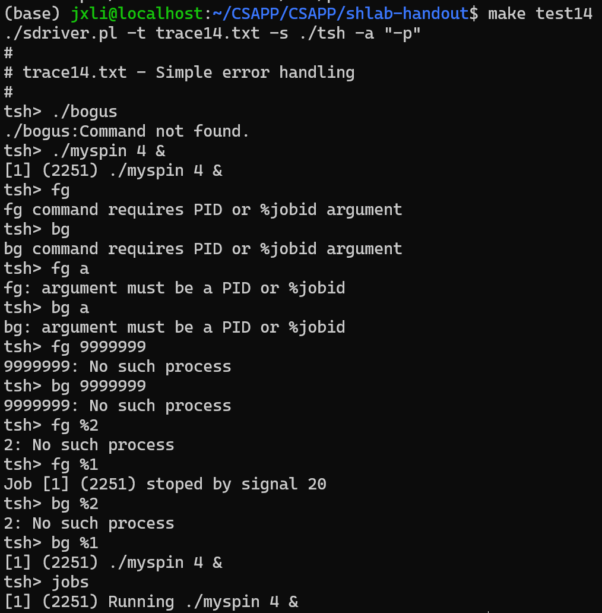

# CSAPP-Labs

这个项目是我学习《深入理解计算机系统》第三版时完成的配套实验，来源[Lab Assignments](http://csapp.cs.cmu.edu/3e/labs.html)。

## Data Lab

#### Lab

用8种最基础的二进制操作符! ˜ & ˆ | + << >>实现其他操作。

实验结果：

x ^ y = (~(x & y)) & (~((~x) & (~y)))   	//x=y=1  x=y=0

x ^ (x+1)  == -1时， x = Tmax or x=-1

x == y    <=>  !(x ^ y)

~x + x = -1

x >= a  <=> x + ~a +1 >=0	

x >= 0 	<=>	 !((x & (1<<31))  >> 31)  	<=> 	!((x >> 31) & 0x1)

x < 0 	<=> 	!((x ^ (1<<31)) >> 31) 	<=> 	(x >> 31) &0x1

x ? y : z	<=>	a = ~(!x) +1,  (~a & y) | (a & z)

!x 	<=> 	((~x + 1) | x) >> 31 + 1	(x=0时, (~x + 1) | x = 0；x != 0时, (~x + 1) | x = -1)

## Bomb Lab

学习调试工具，阅读汇编代码拆解二进制炸弹，理解函数、分支、循环、递归、链表、栈的汇编代码。

实验结果：

1.输入字符串和给定地址0x402400的字符串相同

2.输入6个整数，第一个数是1，后面逐个翻倍，

3.输入和地址0x4025cf相同，即"%d %d"，两个十进制整数。第一个数不大于7，且每个数映射到一个位置，对应另一个数。

4.两个数，第二个是0，第一个数x满足func4(x,0,14)=0，最简单是取7

5.输入6长度字符串，对应Ascii码最后一位+位置数得到一组数，在0x4024b0处有15个字母，这组数对表示位置，得到字母 “flyers“

6.输入6个整数，两两不同，把每个数x变成7-x，每个数在一组链表中跳转7-x-1次，且得到的值从大到小排序，对应345612，再得到原值

7.读phase_6时发现下面还有func7，再往下翻，看到secret_phase，发现隐藏关卡，查询发现phase_defused中调用了这个。首先需要输入6条字符串后才会触发，也就是拆掉前6步。扫描函数的变量有2个，一个时”%d %d %s“，一个是"7 0"，这个7 0非常奇怪，不过只有3，4步符合。加的字符穿需要和0x402622相同，即DrEvil，分别尝试发现是在第四步可以触发，原来7 0就是第四步的输入存在了0x603870的位置。进入隐藏关卡后需要func输出2，又是个链表，走3步，得出结果是第四个数22。

## Attack Lab

实验结果：共4步，答案对应的输入放在"./Attack Lab/ans.txt"文件中，用cat ans.txt | ./hex2raw | ./ctarget来传递字符串。

对两个有安全漏洞的程序攻击，了解缓冲区溢出的风险，理解堆栈和参数传递机制，x86-64指令的编码，以及更多的调试工具的经验。

1~3利用字符串溢出，输入包含可执行代码的字节编码，解析字节后用hew2raw生成需要输入的字符串

1.让读取函数getbuf返回到touch1函数的开始位置，栈大小是40，在40位后面加上touch1的地址

2.返回touch2，且带一个参数，参数==cookie。先返回到之前40大小的栈，然后把cookie赋值给dri，再返回touch2

3.带的参数是个地址，地址存放cookie对应的ASCII码。后续函数会占用后面的栈，所以应该存放在前面。

4多了两种技术防止攻击，栈随机化导致无法确定注入代码位置；把保存堆栈的内存标记为不可执行，把程序计数器改成注入代码的开始位置会导致报错。拆分步骤2的过程，popq rax; movq rax rdi。在rsp+28后加上pop地址，cookie，mov地址，touch2地址，用的全是q，所以每个都是8位的。

## Cache Lab

实验结果：

1.编写缓存模拟器，把valgrind内存跟踪作为输入，模拟缓存内存命中/不命中行为，输出命中、不命中、清除的总数。

难度不高，比较麻烦，把cache结构理解了照着写就好。第一次写的时候用的纯数组实现，三维数组套来套去，第1维组S，第2维行E，第3维放有效位和标记位，有效位顺便可以记录时间。后面看了下别人写的，发现用结构会舒服很多，可读性大大提高。第一次写的放在了csim_old.c里面，后面的在csim.c中。

2.优化矩阵转置函数，只能用12个中间变量，cache结构(5,1,5)，可以存32 * *8个int，考虑把矩阵拆成8* * 8的多个块，极限值是只有冷不命中，即1/8的不命中。注意如果用WSL2写的，得安装valgrind。

32*32：俩矩阵不在相同位置的块就不会冲突，所以除去对角线，其他块可以直接转置。对角块通过把部分值存到B中和变量中，最后misses=276，理论misses=256。

64*64：同一位置的块上下半冲突，需要类似于之前对角块的处理,可以达到理论值。对角线处理则更为复杂，分成2 * 2的小块，共有4 * 4个小块，每次读取2行经行操作，每个8 * 8的对角块只需要26次不命中，计算得出misses是1104。理论misses=1024， 我的misses=1108，多了4次不知道是什么情况。

61*67：条件放的很宽松，尝试直接分成小块做，8 * 8太高了，尝试更大的，用18 * 18得到misses=1971，满足条件。 

## Shell Lab

实验结果：

<figure class="thrid">
    
    
    
</figure>

写一个简易版shell，完成4个运行函数，3个信号处理函数

eval：解析和解释命令行的主要程序。在fork子进程前做mask，添加子进程到作业列表后解除，在子进程中解除mask，以防止race。

builtin_cmd：识别并解释内置命令。

do_bgfg：实现bg和fg内置命令。主要是检查输入格式，然后发送信号给需要唤醒的程序。

waitfg：等待前台作业完成。每次等待前mask所有信号；调用sigsuspend，等价于原子操作，把mask设置为空，每次收到信号并处理结束后停止暂停；函数返回后在把mask设置成prev。

sigchld_handler：捕获SIGCHILD信号。利用waitpid函数的3个参数，有程序结束或停止就返回，然后做信号屏蔽，判断返回状态对不同进程做对应jobs操作，恢复屏蔽。

sigint_handler：捕获sigint (ctrl-c)信号。设置信号屏蔽，找到前台job，发送信号，回复屏蔽。

sigtstp_handler：捕获sigtstp (ctrl-z)信号。同上。

## Malloc Lab

实验结果：

编写一个动态存储分配器，实现 malloc，free 和 realloc 函数。

